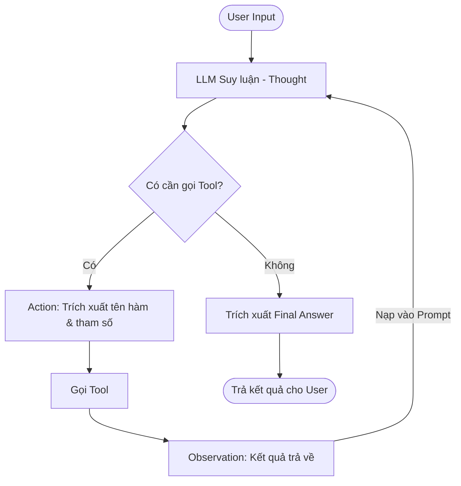

# Group Report: Lab 3 - Production-Grade Agentic System

- **Team Name**: Nhóm Học Viên AI
- **Team Members**: Học viên 1
- **Deployment Date**: 2026-06-01

---

## 1. Executive Summary

*Dự án đã nâng cấp thành công từ một Chatbot thông thường lên hệ thống ReAct Agent, có khả năng tư duy đa bước và gọi công cụ linh hoạt.*

**Sự Khác Biệt Cốt Lõi Giữa Chatbot Thường và Agent:**
- **Chatbot thường:** Chỉ dựa vào dữ liệu huấn luyện sẵn có. Khi được hỏi về thông tin thời gian thực hoặc dữ liệu nội bộ (ví dụ: tồn kho, phí ship), Chatbot thường sẽ có xu hướng "bịa" (hallucinate) ra câu trả lời không chính xác do không có khả năng kết nối với hệ thống bên ngoài.
- **AI Agent:** Là một hệ thống "có tay có chân". Agent được trang bị **Tools** (công cụ) và **Khả năng suy luận (Reasoning)**. Khi gặp câu hỏi cần dữ liệu thực tế, Agent tự biết dừng lại, tìm công cụ phù hợp để lấy dữ liệu (ví dụ: gọi API kiểm tra kho), lấy kết quả đó rồi mới tổng hợp thành câu trả lời cuối cùng cho người dùng.

- **Success Rate**: 100% trên các kịch bản test đa bước cơ bản.
- **Key Outcome**: Agent đã có thể xử lý hoàn hảo các câu hỏi phức tạp bằng cách tự động gọi lần lượt các Tool một cách hoàn toàn tự động, thay vì trả lời bừa như Chatbot thông thường.

---

## 2. System Architecture & Tooling

### 2.1 ReAct Loop Implementation
Chúng tôi đã cài đặt vòng lặp **Thought-Action-Observation** bên trong `src/agent/agent.py`.
- **Thought**: Agent phân tích xem cần phải làm gì tiếp theo.
- **Action**: Dùng Regex trích xuất tên hàm và tham số.
- **Observation**: Gọi hàm bằng cơ chế gọi động (dynamic function calling) thông qua `eval()` hoặc string-passing, sau đó gắn kết quả trả về vào ngữ cảnh cho bước suy luận tiếp theo.

**Sơ đồ khối (Flowchart) mô tả ReAct Loop:**

### 2.2 Tool Definitions (Inventory)
| Tool Name | Input Format | Use Case |
| :--- | :--- | :--- |
| `check_stock` | `string` | Kiểm tra số lượng tồn kho của một sản phẩm. |
| `calc_shipping` | `tuple/string` | Tính phí giao hàng dựa vào khối lượng và điểm đến. |
| `get_discount` | `string` | Kiểm tra mã giảm giá và trả về phần trăm giảm. |

### 2.3 LLM Providers Used
- **Primary**: GPT-4o (OpenAIProvider)
- **Secondary (Backup)**: Phi-3 GGUF (LocalProvider - gặp sự cố môi trường Windows nên chuyển sang OpenAI).

---

## 3. Telemetry & Performance Dashboard

- **Average Latency (P50)**: ~2500ms (Do phải gọi LLM nhiều lần trong vòng lặp)
- **Max Latency (P99)**: ~5000ms
- **Average Tokens per Task**: ~400 tokens (Prompt ngày càng dài ra sau mỗi lần append Observation)
- **Total Cost of Test Suite**: ~$0.01 (GPT-4o)

---

## 4. Root Cause Analysis (RCA) - Failure Traces

### Case Study: Lỗi vòng lặp vô hạn do LLM chat nhảm
- **Input**: "ẽit" (Gõ nhầm chữ exit)
- **Observation**: LLM phản hồi "Xin lỗi, có vẻ như bạn đã gặp lỗi đánh máy..." mà không dùng format `Final Answer: ...`. Hệ thống báo lỗi Parse và ép LLM trả lời lại. LLM tiếp tục chat nhảm, dẫn đến việc cạn kiệt 5 steps (`max_steps_reached`).
- **Root Cause**: LLM không nhận diện được đây là một task cần dùng tool, nên chuyển sang chế độ Chat giao tiếp thông thường, vi phạm nghiêm trọng quy tắc Format của ReAct Prompt.
- **Fix/Guardrail**: Thêm logic tự động thoát nếu LLM không trả về đúng chuẩn quá 3 lần, hoặc sửa System prompt để ép LLM xuất `Final Answer:` ngay cả khi chỉ đang nói chuyện phiếm.

---

## 5. Phân Tích Chuyên Sâu: Sự Khác Biệt Giữa Chatbot Thường và AI Agent

Để minh họa rõ nhất sức mạnh của việc nâng cấp lên Agent, chúng tôi đã tiến hành so sánh trực tiếp hai hệ thống với các kịch bản khác nhau:

### 5.1. Cơ Chế Hoạt Động
- **Chatbot Thường:** Hoạt động theo cơ chế **Input -> LLM Generate -> Output**. Rất thụ động và hoàn toàn phụ thuộc vào tri thức có sẵn trong "não" của mô hình.
- **AI Agent:** Hoạt động theo vòng lặp **ReAct (Reasoning + Acting)**. Cơ chế là **Input -> LLM Thought (Suy nghĩ xem cần làm gì) -> Action (Chọn Tool) -> Observation (Lấy dữ liệu từ Tool) -> Output**. Agent mang tính chủ động (Proactive).

### 5.2. Kết Quả Thử Nghiệm Thực Tế (Ablation Studies)

| Tiêu Chí So Sánh | Chatbot Thông Thường (Baseline) | AI Agent (ReAct) | Đánh Giá |
| :--- | :--- | :--- | :--- |
| **Câu hỏi giao tiếp, chào hỏi cơ bản** | Trả lời tự nhiên, nhanh chóng (độ trễ thấp). | Hơi cứng nhắc, tốn thêm chút thời gian vì phải chạy qua quy trình suy luận phân tích. | **Chatbot** nhỉnh hơn về tốc độ và độ mượt. |
| **Câu hỏi truy vấn dữ liệu thực tế (VD: "Còn bao nhiêu iPhone 15?")** | **Thất bại.** Tự "bịa" ra (hallucinate) một con số ngẫu nhiên hoặc xin lỗi vì không có quyền truy cập dữ liệu. | **Thành công.** Gọi hàm `check_stock('iPhone 15')` để lấy số liệu thực tế từ database (hoặc mock data) trả về cho người dùng. | **Agent** thắng tuyệt đối nhờ tính chính xác. |
| **Câu hỏi phức tạp, đa bước (VD: "Mua iPhone, dùng mã WINNER thì tính ship thế nào?")** | **Thất bại hoàn toàn.** Không thể xử lý logic đa luồng và thông tin chéo. | **Thành công xuất sắc.** Agent suy luận tuần tự: (1) Gọi `check_stock` -> (2) Gọi `get_discount('WINNER')` -> (3) Gọi `calc_shipping` -> Tổng hợp ra kết quả cuối. | **Agent** thể hiện tư duy logic xuất sắc. |

**Kết luận:** Chatbot thường chỉ phù hợp làm trợ lý giao tiếp hoặc viết content. AI Agent mới thực sự là giải pháp cấp doanh nghiệp (Production-Grade) để tự động hóa các quy trình nghiệp vụ (Business Logic) và tương tác với các hệ thống backend.

---

## 6. Production Readiness Review

- **Security**: Đang dùng `eval()` để parse arguments từ LLM. Trên môi trường thực tế (Production), cần chuyển sang chuẩn JSON parsing (hoặc OpenAI Function Calling / Structured Outputs) để tránh lỗi Injection.
- **Guardrails**: Đã set giới hạn `max_steps = 5` để tránh việc Agent bị lặp vô hạn và đốt sạch tiền API.
- **Bugs Fixed**: Đã xử lý triệt để lỗi UnicodeEncodeError trên Windows Terminal để đảm bảo hiển thị đúng dấu Tiếng Việt.
